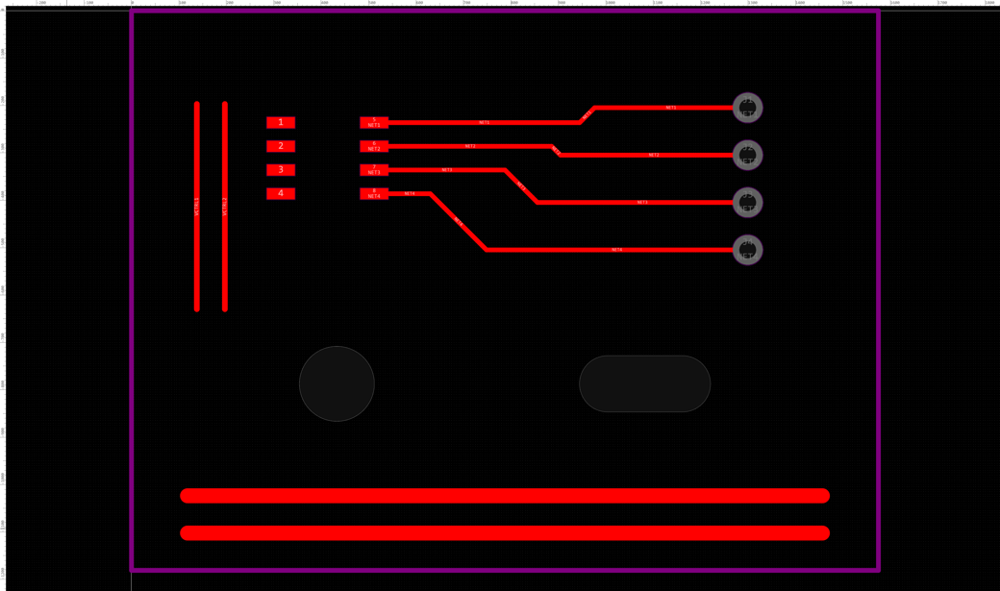
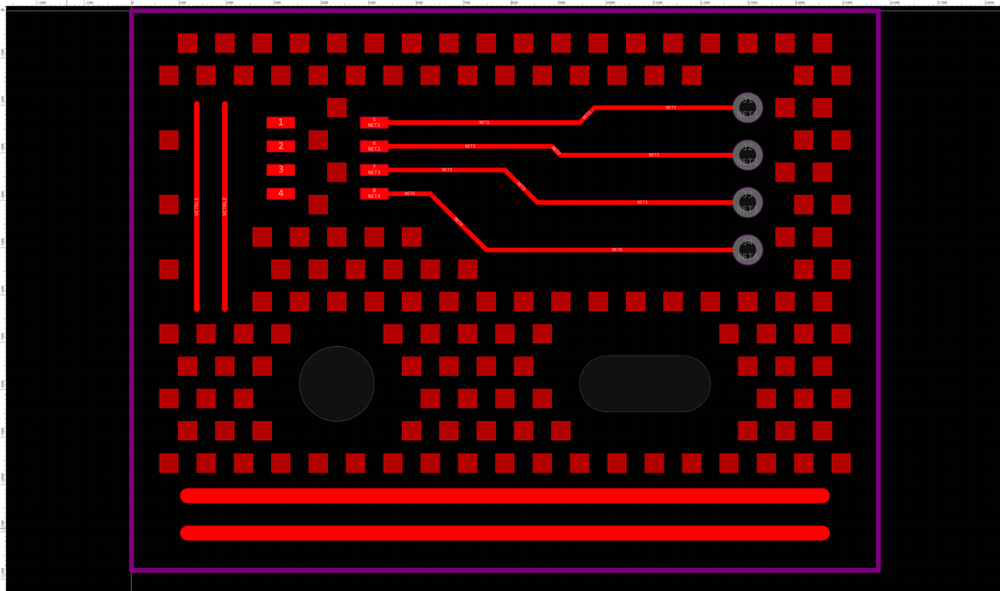

# 盗铜工具 Thieving Copper

[English](./README.en.md)

嘉立创 EDA 专业版扩展：在 PCB 的空旷区域自动铺设盗铜（Thieving Copper），平衡各区域的铜密度，改善蚀刻与电镀的均匀性。

## 功能

- 🧩 **三种铜块** — 正方形、圆形、菱形，尺寸与中心间距可调，支持正交网格与交错排列
- 🛡️ **自动避让** — 走线、圆弧、折线、焊盘、过孔、钻孔、填充、铺铜、铜层文字与图片，按设定的安全间距整体避开
- 🕳️ **板框与挖槽** — 识别板框轮廓、板内挖槽（多层填充）与非金属化孔，按板边间距避让
- 🎯 **三种范围** — 整板空白区、板边环形带、指定矩形区域（可读取当前选中对象的外框）
- 🧱 **多层一次生成** — 可同时处理顶层、底层与已启用的内层，可指定网络或不连接网络
- 👀 **仅预览数量** — 完整跑一遍分析但不创建图元，先试参数再决定
- 🧹 **两种删除** — 按生成记录精确撤销，或按尺寸清理没有记录的盗铜
- 💾 **记住参数** — 面板参数下次打开沿用

## 功能演示

一块 40×30 mm 的示例板，板上有贴片焊盘、排针通孔、扇出走线、两条电源走线，以及一个圆形挖孔和一个圆角长槽：



用默认参数（1 mm 正方形、2 mm 中心间距、与铜箔 0.5 mm、与板边 1 mm、交错排列）在顶层铺设盗铜，一次生成 144 个铜块。走线、焊盘、两个挖槽以及板框四周都自动留出了间距：



## 安装

1. 从 [Releases](https://github.com/Oriuguisu/lceda-thieving-copper/releases) 下载 `lceda-thieving-copper_vX.Y.Z.eext`
2. 打开嘉立创 EDA 专业版，进入扩展管理
3. 选择安装本地扩展，载入下载的 `.eext` 文件
4. 打开任意 PCB 文档，顶部菜单会出现「盗铜工具」

## 快速开始

1. 打开 PCB 文档，菜单选择「盗铜工具」→「盗铜面板…」
2. 勾选目标铜层，确认铜块尺寸、中心间距与两个安全间距
3. 先点「仅预览数量」，它只做分析不创建图元
4. 数量合理后点「生成盗铜」
5. 生成后运行一次 DRC 复核间距

## 菜单功能

| 菜单项 | 说明 |
| --- | --- |
| **盗铜面板…** | 完整参数界面，推荐使用 |
| **快速盗铜（对话框）…** | 不打开面板，用系统对话框依次填写关键参数，按整板铺设 |
| **删除本插件生成的盗铜…** | 按生成记录撤销，不会动到手工绘制的铜 |
| **使用说明** | 功能摘要 |

面板上有两个删除按钮：「删除本插件记录的盗铜」按生成记录精确撤销；「按尺寸删除全部盗铜」用于记录丢失的情况，它扫描当前勾选的铜层，删掉外框尺寸与「铜块尺寸」一致的单环填充，因此手工画的同尺寸小填充也会被算进去。两个按钮都需要在提示后 6 秒内再点一次确认。

## 参数说明

| 参数 | 含义 |
| --- | --- |
| 铜块尺寸 | 单个盗铜的外接尺寸，正方形为边长，圆形为直径，菱形为对角线长 |
| 中心间距 | 相邻盗铜中心的距离，必须大于铜块尺寸加安全间距 |
| 排列方式 | 交错排列铜密度更均匀，正交网格更整齐 |
| 与既有铜箔 | 盗铜与原有铜之间保留的最小间距 |
| 与板边 | 盗铜与板框、板内挖槽、非金属化孔之间保留的最小间距 |
| 空白判定精度 | 空白区域的栅格分辨率，越小越准也越慢，大板会自动降精度 |
| 最多生成数量 | 上限保护，避免一次创建过多图元导致编辑器卡顿 |

矩形范围模式下，可以先在画布里框选对象，再点面板里的「读取当前选中对象的外框」自动填入坐标。坐标为画布坐标，单位毫米。

## 工作原理

1. 读取板框层的线、弧、折线，首尾相接拼成闭合轮廓，最大的环作为板外框，落在其内部的环作为挖空；多层上的填充与折线、以及非金属化孔一并视为板内挖槽。
2. 对每个目标铜层收集所有既有铜箔，把它们按设定的安全间距膨胀后画进一张覆盖整板的栅格遮罩。
3. 以数据原点为相位铺开候选网格，只保留整块都落在空白栅格内的位置，因此同一块板重复运行的结果一致。
4. 批量创建实心填充（Fill）图元。

## 从源码构建

```bash
npm install
npm run typecheck
npm run lint
npm run build
```

扩展包会生成在 `build/dist/lceda-thieving-copper_vX.Y.Z.eext`。`npm run verify` 可以检查包内文件与内联窗口的关键内容是否齐全，`npm run debug` 启动监听与热推送。

`iframe/` 整个目录都是构建产物：面板界面的源文件是 `src/ui/index.html`，构建时会把打包后的脚本内联进去再输出到 `iframe/index.html`。这是因为 EDA 内联窗口对外链脚本等关联资源的读取并不可靠，只用外链会让面板停在初始状态；现在外链和内联两份同时保留，脚本自身用全局标志位保证只初始化一次。

## 只读自检

`src/tools/dryrun.ts` 是一个不参与打包的自检入口，用来在真实 PCB 上验证板框识别、障碍收集与空位计算，并用解析式距离计算独立复核每个候选位置的间距，同时报告当前 EDA 版本上各个可选接口是否存在。

```bash
npm run dryrun
```

产物 `build/dryrun.js` 可以直接作为 `async function (eda) { ... }` 的函数体执行（例如粘进 EDA 的独立脚本），全程不创建任何图元。

## 注意事项

- 盗铜输出为实心填充（Fill）图元，位于所选铜层。
- 生成结果依赖板框闭合。如果板框有断口，拼接会失败并提示。
- 空白判定基于栅格，边缘抗锯齿像素一律按「不可用」处理，因此结果偏保守。仍建议生成后运行一次 DRC 复核间距。
- 圆弧按带符号圆心角采样，若个别圆弧走线的避让位置看起来偏移，请适当加大与铜箔的安全间距。
- 无法解析轮廓的异形焊盘会被跳过并在结果中提示。
- 暂停画布更新计算的接口只在 EDA v4.2 及以上存在，较早版本会退化为边建边刷，速度略慢但结果相同。
- 删除功能依赖本插件保存的生成记录（按文档区分）。手工删除过部分盗铜不影响其余的删除。
- 一次生成数千个图元会明显增加文件体积和编辑器负担，建议先用较大的中心间距试铺。

## 开源许可

本扩展使用 [Apache License 2.0](https://choosealicense.com/licenses/apache-2.0/) 开源许可协议。
